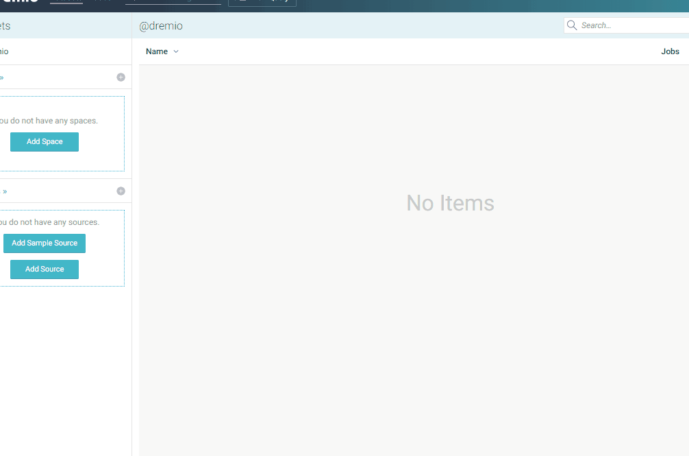

# Dremio Snowflake Connector

 


[](https://travis-ci.org/narendrans/dremio-snowflake)

<!--ts-->
   * [Overview](#overview)
   * [Demo](#demo)
   * [Downloading a Release](#downloading-a-release)
   * [Usage](#usage)
   * [Development](#development)
      * [Building and Installation](#building-and-installation)
      * [Debugging](#debugging)
   * [Contribution](#contribution)
      * [Submitting an issue](#submitting-an-issue)
      * [Pull Requests](#pull-requests)
<!--te-->

Overview
-----------

This is a community based Snowflake Dremio connector made using the ARP framework. Check [Dremio Hub](https://github.com/dremio-hub) for more examples and [ARP Docs](https://github.com/dremio-hub/dremio-sqllite-connector#arp-file-format) for documentation. 

_This is not an official Dremio connector. THE SOFTWARE IS PROVIDED "AS IS", WITHOUT WARRANTY OF ANY KIND._ 

Demo
-----------



Downloading a Release
-----------

* To download a release, [click here](https://github.com/narendrans/dremio-snowflake/releases)


Usage
-----------

### Creating a new Snowflake Source

### Required Parameters

* Account name 
    * A quick way to get this is to copy it from the URL - https://<ACCOUNT NAME>.snowflakecomputing.com/
* Username, Password
    * The username and password with which you want to connect to Snowflake 


## Development

Building and Installation
-----------

1. In root directory with the pom.xml file run `mvn clean install`
2. Take the resulting .jar file in the target folder and put it in the <DREMIO_HOME>\jars folder in Dremio
3. Download the Snowflake JDBC driver from (https://mvnrepository.com/artifact/net.snowflake/snowflake-jdbc/3.8.6 and click on the JAR link) and put in in the <DREMIO_HOME>\jars\3rdparty folder
4. Restart Dremio

Debugging
-----------
To debug pushdowns for queries set the following line in `logback.xml`

```
<logger name="com.dremio.exec.store.jdbc.dialect.arp.ArpYaml">
   <level value="${dremio.log.level:-debug}"/>
</logger>
 ```
  
You can then notice lines like below in server.log file after which you can revist the YAML file to add pushdowns based on [Snowflake SQL Reference](https://docs.snowflake.net/manuals/sql-reference-commands.html):

```diff
- 2019-07-11 18:56:24,001 [22d879a7-ce3d-f2ca-f380-005a88865700/0:foreman-planning] DEBUG c.d.e.store.jdbc.dialect.arp.ArpYaml - Operator / not supported. Aborting pushdown.
```

You can also take a look at the planning tab/visualized plan of the profile to determine if everything is pushed down or not.

Contribution
------------

### Submitting an issue

* Go to the issue submission page: https://github.com/narendrans/dremio-snowflake/issues/new/choose. Please select an appropriate category and provide as much details as you can.

### Pull Requests

PRs are welcome. When submitting a PR make sure of the following:

* Try to follow Google's Java style coding when modifying/creating Java related content.
* Use a YAML linter to check the syntactic correctness of YAML file
* Make sure the build passes
* Run basic queries at least to ensure things are working properly
